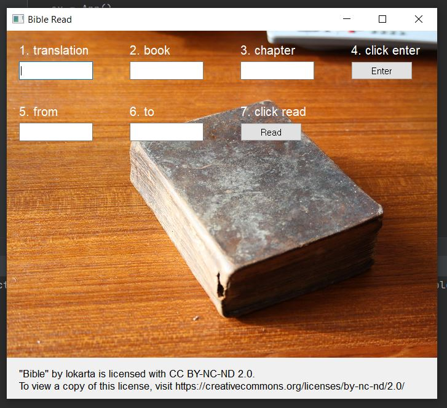
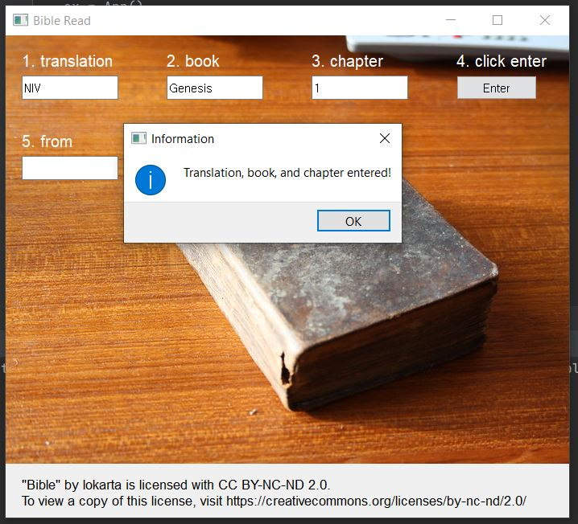
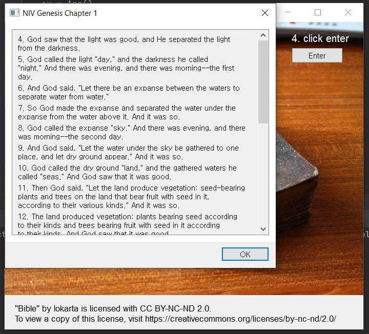

# BibleRead :church:

BibleRead is a bible reading application that allows people to read bible without spending too much time on searching for the right phrases. 

## Build Instruction
1. Git clone:
    ```bash
    $ git clone https://github.com/mywonkim/BibleRead.git
    $ cd BibleRead
    ```
2. Install required Python packages:
    ```bash
    $ pip install .
    ```
3. Make an executable file:
    ```bash
    $ python setup.py build
    ```
4. Run the executable.
5. Alternatively, simply run main.py if you have an IDE.

## Description

This application helps you focus more on reading, not searching. If you simply type in a translation, book, chapter, starting phrase and ending phrase, you will be able to read what you want to read in seconds.

Here are some screenshots of application usage:



## Usage
READ THE INSTRUCTION BEFORE YOU USE THIS APPLICATION!

Here is the instruction:

1. Enter the translation, book, and chapter accurately
2. Click the "Enter" button and make sure the message "Translation, book, and chapter entered!" shows up
3. Enter the starting phrase and ending phrase accurately
4. If you want to read only one phrase, simply enter the starting phrase only
5. Enjoy your reading

## Available Translations
Available translations are:

1. 개역개정
2. 개역한글
3. 공동번역
4. 새번역
5. 현대인
6. NIV
7. KJV
8. NASB

## Image License


"Bible" by lokarta is licensed with CC BY-NC-ND 2.0. To view a copy of this license, visit https://creativecommons.org/licenses/by-nc-nd/2.0/
